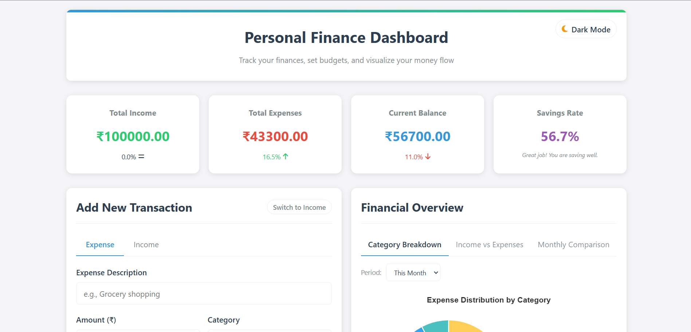
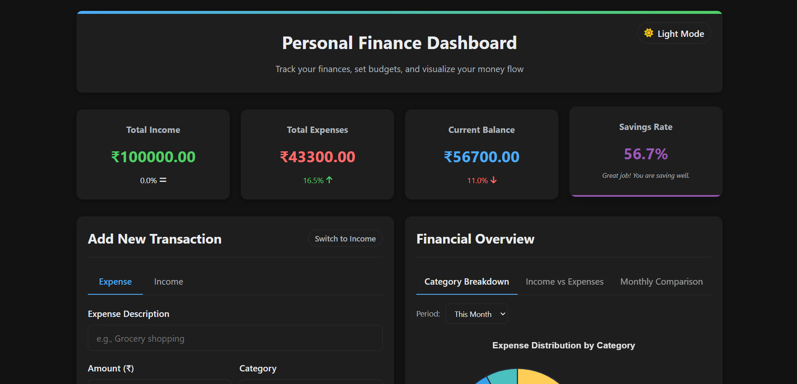
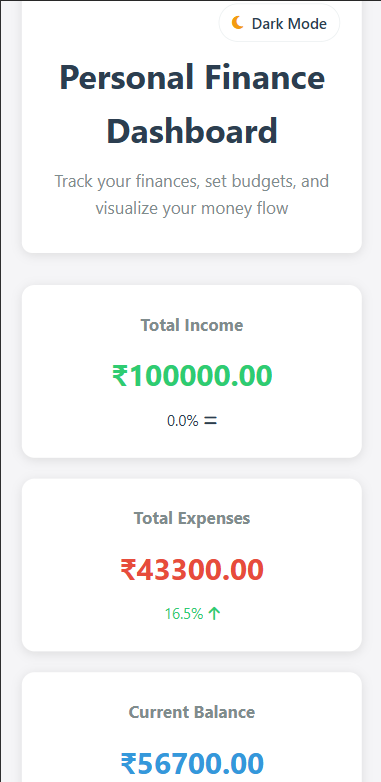

# Personal Finance Dashboard

A comprehensive and responsive web application to track personal finances, manage budgets, set financial goals, and visualize spending patterns. This dashboard provides a complete financial overview with interactive charts, transaction management, and savings planning tools.

## Features

### Financial Tracking
- **Income & Expense Management**: Add, edit, and delete transactions with detailed categorization
- **Transaction History**: View all transactions with powerful filtering options (type, period, search)
- **Financial Summary**: Real-time overview of total income, expenses, balance, and savings rate
- **Trend Analysis**: Month-over-month comparison of financial metrics

### Budgeting Tools
- **Category Budgets**: Set monthly budgets for different expense categories
- **Budget Progress**: Visual progress bars showing spending against budget limits
- **Spending Alerts**: Color-coded indicators for budget thresholds (70%, 90%)

### Financial Planning
- **Goal Tracking**: Set and monitor financial goals with progress visualization
- **Savings Calculator**: Project future savings with compound interest calculations
- **Monthly Comparison**: 6-month trend analysis of income vs expenses

### Data Visualization
- **Interactive Charts**:
  - Expense breakdown by category (Doughnut chart)
  - Monthly income vs expenses (Bar chart)
  - 6-month financial trend (Line chart)
- **Customizable Views**: Filter charts by time period (week, month, all time)

### User Experience
- **Dark/Light Mode**: Toggle between color themes
- **Responsive Design**: Works on all device sizes
- **Data Management**: Import/export financial data as JSON
- **Sample Data**: Quick-start with demo financial data

## Tech Stack

- **Frontend**: HTML5, CSS3, JavaScript (ES6+)
- **Charting**: Chart.js (v3.9.1)
- **Icons**: Font Awesome (v6.4.0)
- **Design**: CSS Variables for theme switching
- **Storage**: Browser localStorage for data persistence

## Getting Started

### Local Development
1. **Clone the repository**:
   ```bash
   git clone https://github.com/anish-3041/Personal-Finance-Dashboard.git
   ```
2. **Navigate to the project folder**:
   ```bash
   cd Personal-Finance-Dashboard
   ```
3. **Open the `index.html` file** in your browser

## Getting Started

### Local Development
1. Download or clone the repository to your local machine
2. Navigate to the project folder in your file explorer
3. Open the `index.html` file in your preferred web browser

### Deployment Options
This static website can be easily deployed on various platforms:

**GitHub Pages (Recommended)**
- Go to your repository on GitHub
- Navigate to Settings → Pages
- Select the main branch and root directory
- Click Save - your site will be live at:  
  `https://<your-username>.github.io/Personal-Finance-Dashboard/`

**Alternative Hosting Services**
- Netlify (Drag and drop deployment)
- Vercel (Optimized for static sites)
- Any web hosting service that supports static files

## Usage Guide

### Adding Transactions
1. Click on "Add New Transaction"
2. Switch between Income/Expense tabs as needed
3. Fill in all required details:
   - Description (e.g., "Monthly Salary")
   - Amount (e.g., "50000")
   - Category (select from dropdown)
   - Date (defaults to current date)
4. Click "Add Income" or "Add Expense" to save

### Setting Budgets
1. Navigate to the "Budget Management" card
2. Select a category from the dropdown
3. Enter your monthly budget amount
4. Click "Set" to save
5. View your budget progress with visual indicators

### Tracking Financial Goals
1. Go to the "Financial Goals" section
2. Click "Add Goal" and provide:
   - Goal name (e.g., "New Car")
   - Target amount
   - Target date
   - Current savings
3. The dashboard will automatically calculate:
   - Progress percentage
   - Days remaining
   - Required monthly savings

### Analyzing Your Finances
1. Use the "Financial Overview" charts:
   - Switch between chart types using tabs
   - Filter by time period (Week/Month/All Time)
   - Hover over chart elements for detailed values
2. Check the dashboard summary for key metrics:
   - Total Income/Expenses
   - Current Balance
   - Savings Rate

### Data Management
- **Export Data**: Download all your financial data as JSON
- **Import Data**: Restore from a previously exported file
- **Sample Data**: Load demonstration data to explore features

## Screenshots

 - Dashboard with light color theme  
 - Dashboard with dark color theme  
 - Responsive layout on smaller screens  

## Contributing

We welcome contributions to improve this project. Here's how you can help:

1. Report bugs or suggest features by opening an issue
2. Fork the repository and create a new branch
3. Make your improvements or additions
4. Submit a pull request with a clear description of changes

Please ensure your code follows the existing style and includes comments where appropriate.

## License

This project is protected under All Rights Reserved license. The source code is provided for personal and educational use only. Any unauthorized copying, modification, or distribution without explicit permission from the author is prohibited.

## Contact

For inquiries, support, or collaboration opportunities:

- Email: anishkumar2960.sths@gmail.com
- GitHub: github.com/anish-3041